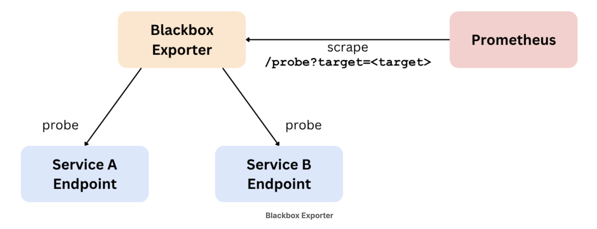

# Blackbox Monitoring

## Overview

Blackbox monitoring means monitoring a system's or service’s health from the outside. While monitoring and alerting whitebox metrics coming from the inside of your services is recommended, blackbox monitoring can be a useful addition to verify that a service behaves the way you expect from the user's point of view. For example, in addition to a service's own metrics about its availability and request latencies, you may want to send regular probe requests to the service from the outside and ensure that they succeed and are processed in a timely fashion. You may also want to verify that the response contains certain information.

## Blackbox Exporter

The Blackbox Exporter is a Prometheus component that allows probing a remote service in various ways:

- HTTP(s)
- DNS
- TCP
- ICMP

For each of the listed probe types, the exporter exposes metrics that tell you whether the probe succeeded, how long it took to complete, and other probe-specific metrics.

The Blackbox Exporter is special in the way it is told which targets to probe. Instead of replicating service discovery logic in the Blackbox Exporter, it takes advantage of the Prometheus server's existing service discovery support. Prometheus discovers targets to scrape and then scrapes the Blackbox Exporter once for each service target to probe, passing the service endpoint as a target HTTP parameter to the Blackbox Exporter during the scrape itself. Like this:

This requires a three-step relabeling process in Prometheus:

Move the address of the discovered target into a **param_target label (which places the target to probe into a target HTTP query parameter during the scrape)
Explicitly set the instance label to the value of that target query parameter as well
Set the address that Prometheus should scrape (**address\_\_ label) to the address of the Blackbox Exporter instead of the service target.

This is a possible configuration to the blackbox:

    modules:
      http_2xx:
        prober: http
        timeout: 2s
        http:
          method: GET
          preferred_ip_protocol: "ip4"

This configures the Blackbox Exporter to allow probing targets over HTTP. The module name (http_2xx) can be freely chosen, but needs to match the value that Prometheus sends in the module HTTP parameter during a scrape to the Blackbox Exporter. This is how Prometheus chooses which type of probe to run through the exporter.

Note: The timeout for a probe from the Blackbox Exporter to a backend target needs to be smaller than Prometheus’s own timeout when scraping the exporter. Otherwise, Prometheus will see the Blackbox Exporter as down (with an up metric value of 0), instead of receiving information about the backend target being down.

The Prometheus server should now automatically start scraping the Blackbox Exporter. Head to your Prometheus server's targets page at http://<machine-ip>:9090/targets and verify that the discovered service probe targets are visible there.

Note: You should see all three Blackbox Exporter probe targets in the UP state, but that does not mean that the target probes succeeded. It only means that the scrape of the Blackbox Exporter itself worked, as the exporter can even return useful metrics about the service probe if the probe failed. The exact metrics returned about the backend probe depend on the Blackbox Exporter module in either case.

In the case of the HTTP prober module, several metrics related to the probe are returned, for example:

- probe_duration_seconds: How many seconds the backend probe took
- probe_success: Whether the probe was overall successful (0 or 1)
- probe_http_status_code: The backend’s HTTP status code
- probe_http_content_length: The length in bytes of the backend HTTP response content
- probe_http_redirects: How many redirects were followed
- probe_http_ssl: Whether the probe used SSL in the final redirect (0 or 1)
- probe_ssl_earliest_cert_expiry: In the case of an SSL request, the Unix timestamp of the certificate expiry
- probe_ip_protocol: The IP protocol version used for the backend probe (4 or 6)

You should see a value of 0 (unsuccessful probe) for the http://example.com:8080 target and a 1 for the other targets. Note that http://prometheus.io redirects permanently to https://prometheus.io. The Blackbox Exporter follows redirects, and thus even the http://prometheus.io target probe will include SSL/TLS-related metrics like certificate expiry.

You should see a value of 0 (unsuccessful probe) for the http://example.com:8080 target and a 1 for the other targets. Note that http://prometheus.io redirects permanently to https://prometheus.io. The Blackbox Exporter follows redirects, and thus even the http://prometheus.io target probe will include SSL/TLS-related metrics like certificate expiry. You can find out in how many days the SSL certificate for prometheus.io will expire by querying for:

    (probe_ssl_earliest_cert_expiry{job="blackbox", instance="https://prometheus.io"} - time() )/ 86400

This kind of expression is useful for alerting on soon-to-expire certificates.
