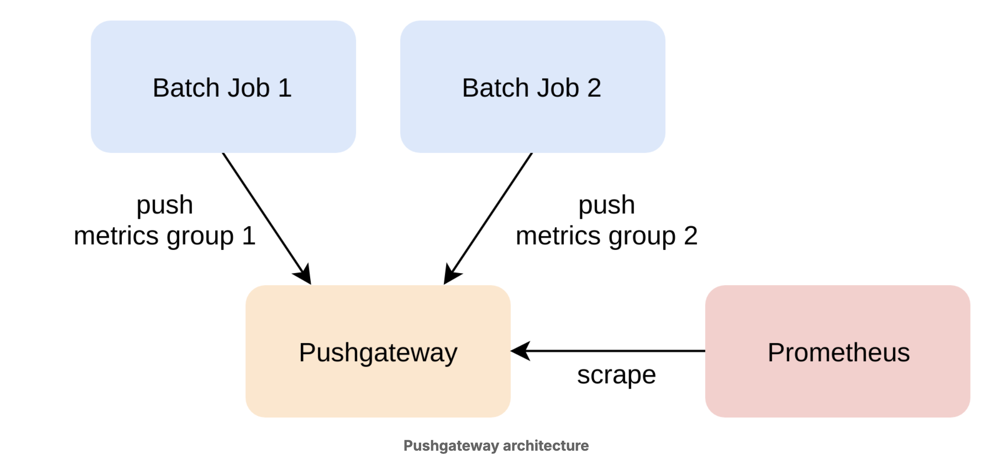

# Pushing Data

## Challenges with Pulling Data

Prometheus is a pull-based monitoring system that expects to be able to scrape metrics from other processes over HTTP. Other Prometheus features also assume that the server is in control of collecting metrics and assigning timestamps to incoming samples at its own pace. For example, recording and alerting rules are evaluated based on the server's notion of the current time. Thus, the underlying metrics must arrive in lockstep with rule evaluations, and a pull model is the best way to ensure this. Service discovery and automatic target health monitoring (via the synthetic up metric) are other features that rely on the pull model. Trying to convert Prometheus into a general push-based system is not advisable.

However, pulling metrics is sometimes impossible or impractical. For example, batch jobs might run too briefly to be scraped, or a network firewall might hinder Prometheus from establishing connections to targets. Some of these use cases fall outside of the scope of Prometheus, while others can be solved using an intermediary component called the Pushgateway.

The Pushgateway is a core Prometheus component that runs as a separate server and allows other jobs to push groups of metrics to it over HTTP using Prometheus's text-based metrics exposition format. The Pushgateway caches the last received sample value for each metric and exposes all pushed metrics to Prometheus for regular scraping.

Note that the Pushgateway does not act as an aggregator or event counter. It only remembers the last value of each metric that was pushed to it. Prometheus will then periodically scrape that last value with an ongoing timestamp as assigned by the pulling server. Multiple jobs can push metrics to the Pushgateway without interfering with each other by defining grouping labels (typically the job label) for the metrics they send. Thus, each job will only overwrite its own metrics group on every push, while all other jobs' groups will remain untouched. A pushing job can also choose whether it wants to replace an entire group of metrics or only update metrics that are included in the latest push to that group (PUT vs POST HTTP methods).

The Pushgateway should mainly be used for monitoring service-level batch jobs: that is, jobs that run too briefly to be scraped, and where you do not care about tracking (in a label value) the specific machine or process that executed the batch job. An example of a service-level batch job is one that runs once per hour and deletes a number of stale users for an entire service. Do not try to use the Pushgateway to turn Prometheus into a general push-based system for process or machine-level monitoring.

There are multiple reasons for this:

- The Pushgateway never forgets metrics. Thus if you group metrics by process (e.g. using an instance label) or machine and you later turn down the source process or machine, you will need to manually delete the corresponding metrics groups in the Pushgateway or they will be scraped forever
- The Pushgateway becomes a single point of failure for all pushed metrics.
- You lose the benefits of service discovery support and automatic health monitoring of the original targets.

The Pushgateway does not require configuration. If you wanted to persist pushed metrics across restarts in a file, you could provide a value to the --persistence.file command-line flag. For now, you can omit this flag to only keep metrics in memory.

The Pushgateway exposes metrics about itself as well as the groups of metrics that other jobs have pushed to it under the /metrics HTTP path. Thus you can simply scrape it like any other target.

Add the following list entry to the scrape_configs section in your prometheus.yml to scrape the Pushgateway:

      - job_name: "pushgateway"
        honor_labels: true
        static_configs:
          - targets: ["pushgateway:9091"]

Note the honor_labels: true scrape option. Because the Pushgateway proxies metrics from other jobs that usually already attach their own job label to a group of metrics, you will want to prevent Prometheus from overwriting any such labels with the target labels from the scrape configuration.

Now let's simulate a batch job:
This batch job simulates deleting a random number of users and then pushes the timestamp of its last successful run, the timestamp of its last overall run (successful or not), as well as the number of deleted users to the Pushgateway. Exposing such timestamps proves to be useful for monitoring and alerting on the overall health of periodic batch job runs

You can find the script in ./local-environment/docker-compose/batch-job.sh

Note that the command embeds the $(date +%s) command output above to generate up-to-date Unix timestamps for the timestamp-based metrics on each run.

Head to http://<machine-ip>:8018/ to verify that the metrics are visible in the Pushgateway's web interface. There should now be one metrics group with the grouping label job="demo_batch_job". Click on the group to expand it and view details about its metrics.

    time() - demo_batch_job_last_run_timestamp_seconds{job="demo_batch_job"}

THis tells you how many seconds ago the last successful run happened. We can also discover batch job that does not run successfully in the last hour

    time() - demo_batch_job_last_successful_run_timestamp_seconds{job="demo_batch_job"} > (60 \* 60)

Finally, when a batch job is deprovisioned for good, you will want to delete its metrics from the Pushgateway so that Prometheus stops scraping them. You can either do this from the Pushgateway's web interface, or you can delete a metrics group using the Pushgateway's web API and the DELETE HTTP method. Here you will use the web API.

    curl -X DELETE http://localhost:8018/metrics/job/demo_batch_job
