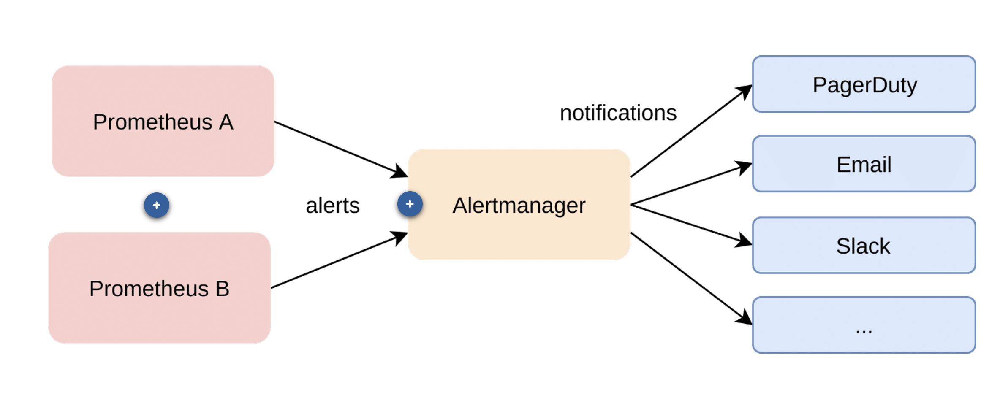
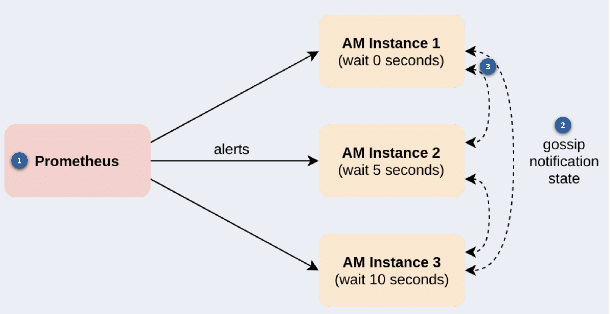

# Alerting

## Overview

Below is a summary of the most important recommendations:

- Alert on user-visible service-level symptoms (such as availability, latency, and error rates of a web service) rather than all possible underlying causes (such as high load or CPU)
- Alert on imminent dangers to your service (such as a disk running full in several hours)
- Alert in a way that is actionable (there is something that can be done to remedy the problem)
- Still collect cause-based metrics as supplementary information to help you debug incidents
- Err on the side of removing noisy alerts to reduce on-call fatigue

## Architecture

In the Prometheus ecosystem, alerting responsibilities are split up between the Prometheus server and the Alertmanager. Typically one would run multiple Prometheus servers in an organization that all send alerts to the same Alertmanager



1. Prometheus: Periodically evaluates a set of configured alerting rules based on PromQL Continuously sends any firing alerts to a configured Alertmanager (cluster)
2. Alertmanager: Acts as a central clearing house for alerts from multiple Prometheus servers Has logic for routing alerts based on their label sets, manually silencing alerts, and configuring alert dependencies Sends out actual notifications to systems such as PagerDuty, Slack, Email, and so on

## Features

### Routes

Routes are the heart of the Alertmanager configuration and determine how alerts are grouped into notifications, and what kind of notification should finally be sent out for them (email, PagerDuty, Slack, etc.).

Routes can be hierarchical. For example, a top-level route might match all the alerts of one service by their service label and set some defaults for all the alerts in that routing group. However, you could then define a sub-route within that route that matches only a subset of the alerts for that service and decides to route them differently by overriding some of the settings of the parent route. This allows you to build detailed routing trees.

Study the following excerpt of an Alertmanager’s routes configuration:

```yaml
# Root route.
route:
  group_by: ["alertname", "cluster", "service"]
  group_wait: 30s
  group_interval: 5m
  repeat_interval: 3h
  # Send everything to team-X-emails by default.
  receiver: team-X-mails
  # Child routes.
  routes:
    # Send alerts for some services to team Y, critical ones to their pager.
    - match_re:
        service: ^(foo1|foo2|baz)$
        receiver: team-Y-mails
        routes:
          - match:
              severity: critical
            receiver: team-Y-pager
    # This route handles all alerts coming from a database service. If there's
    # no team to handle it, it defaults to the DB team.
    - match:
        service: database
      receiver: team-DB-pager
      # Also group alerts by affected database.
      group_by: [alertname, cluster, database]
      routes:
        - match:
            owner: team-X
          receiver: team-X-pager
        - match:
            owner: team-Y
          receiver: team-Y-pager
```

In this configuration file, all alerts are grouped by their alertname, cluster, and service labels by default and sent to team X's email receiver. For the services foo1, foo2, and baz, alerts are sent to team Y's email INSTEAD, unless they also have a critical severity, in which case they will be sent to team Y's pager. Alerts for the database service are grouped differently (by database rather than by service), and the alert's owner label is used to route alerts to the right team's pager.

### Silence

Silences allow you to pause notifications for a given set of alerts for a specified period of time. Silences are usually created through the web UI and allow matching alerts based on a set of label equality or regular expression matchers. Silences are useful if you have an ongoing outage and don’t want to receive further notifications about a set of related alerts, or when you are preparing a maintenance operation on some piece of infrastructure.​ Silences are persisted in the Alertmanager’s on-disk database and replicated between highly available Alertmanager cluster instances.

### Inhibition Rules

Inhibition rules allow modeling of service dependencies. For example, if the main database for a service is down, you may only want to send notifications about the database being down, and not about all the service components now failing because they cannot reach the database. Inhibition rules allow you to define a set of target alerts for which notifications should be suppressed when a set of source alerts is active.

### Notification Types

Alertmanager supports several different built-in notification types. It can send notifications to Slack, Email, PagerDuty, OpsGenie, and other notification services. In case Alertmanager does not support the notification type that you need, you can build your own by using Alertmanager’s generic webhook notifier.

### Notification Templates

Alertmanager allows you to customize the style and content of the actual alert notifications that get sent out.

## Highly Available AlertManager

To make alerting reliable, it is not sufficient to have a highly available Prometheus setup (which you will learn about later). The Alertmanager itself also needs to be made fault-tolerant. Next, you will learn how the Alertmanager achieves this and set up a highly available Alertmanager configuration.

When making Alertmanager highly available, you cannot just run multiple instances that have no knowledge of each other. The problem is that you want to receive each notification only once, instead of from each Alertmanager instance. You would also not want to create a highly consistent cluster using consensus algorithms such as Paxos or Raft, as those setups would fail to accept new writes in a failure case (meaning, alerts cannot be processed anymore). Instead, Alertmanager aims for availability over consistency.



1. Prometheus sends alerts to all instances of an Alertmanager cluster.
2. Gossip Notification State. The Alertmanager instances gossip the notification state of each alert group among each other.
3. Ordering The Alertmanager instances establish an ordering among themselves and wait progressively longer before sending out notifications along that order.

This means that in the healthy case, only the first Alertmanager instance will send out notifications, as the others will learn via gossip about the already-sent notifications from the first instance before their wait time runs out.

Only in the degraded case, when there is a network partition between Alertmanager instances, multiple instances will send out the same notification. That is still preferred over not receiving any notification at all. Thus, Alertmanager optimizes for at-least-once-delivery.

## Configuring AlertManager

```yaml
route:
  group_by: ["alertname", "job"]
  group_wait: 30s
  group_interval: 5m
  repeat_interval: 3h
  receiver: test-receiver
```

This configuration groups all incoming alerts by their alertname and job labels and waits 30 seconds (group_wait) before sending a notification for a group.
This delay allows other alerts belonging to the same group to arrive and be included in the notification.

After that, a notification containing all alerts in the group is sent.

If new alerts for the same group arrive later, another notification is sent after 5 minutes (group_interval).

Finally, if any alerts in the group are still firing after 3 hours (repeat_interval), the notification is sent again as a reminder.

Now we can create our custom receiver, since we don't have a slack account or opsgenie etc...

Check the `./receiver` folder to check how to implement a custom receiver

Of course we have to add the receivers section in the alertmanager config:

```yaml
receivers:
  - name: test-receiver
    webhook_configs:
      - url: http://rcvr:9595/
```

In the docker compose for the alert manager we set this property
--cluster.listen-address=""

This disables the cluster port that Alertmanager listens on for peer gossip notifications, as this is only relevant when running Alertmanager in a highly available cluster.

### Configuring Alerting Rules

Let's say you wanted to alert on HTTP paths that have a 5xx error rate percentage larger than 0.5%. You can try graphing the following expression to see that some paths actually sometimes have a higher error rate than 0.5%:

```promql
sum by(path,instance,job) (rate(demo_api_request_duration_seconds_count{job="lf-app", status=~"5.."}[1m])) / sum by(instance,job, path) (rate(demo_api_request_duration_seconds_count{job="lf-app"}[1m])) * 100
```

Configure prometheus to load alerting rules for another file add the following section to the prometheus configuration

```yml
rule_files:
  - alerting_rules.yml
```

Create the file alerting_rules.yml with the following content

```yml
groups:
  - name: lf-service-alerts
    rules:
      - alert: Many5xxErrors
        expr: |
          sum by (path, instance, job) (
            rate(demo_api_request_duration_seconds_count{status=~"5..", job="lf-app"}[1m])
          )
          /
          sum by (path, instance, job) (
            rate(demo_api_request_duration_seconds_count{job="lf-app"}[1m])
          )
          * 100 > 0.5

        for: 30s

        labels:
          severity: critical

        annotations:
          description: "The 5xx error rate for path {{ $labels.path }} on {{ $labels.instance }} is {{ $value }}%."
```

This example alerting rule instructs Prometheus to send alerts for any instance and path label combinations that have an error rate of more than 0.5% for more than 30 seconds. Note that this for duration is quite short, in order to quickly produce visible results. In real alerting rules, a more common value would be 5 minutes (for: 5m).

This rule will also attach an extra severity="critical" label to any generated alerts. This extra label could be used to route alerts to a pager or other critical notification mechanism via the Alertmanager routing configuration.

Finally, a human-readable description annotation is sent along with each alert, which you could choose to include in notification templates on the Alertmanager side.

To tell Prometheus to send alerts to your Alertmanager, configure its address statically in the alerting section of the ~/prometheus/prometheus.yml configuration file (note that you could also use service discovery here).

```yml
alerting:
  alertmanagers:
    - static_configs:
        - targets:
            - alertmanager:9093
```

As you can see now, there is a alert configured in prometheus which fires an alert to the alertmanager (you can see it in the alert manager ui), and you can see the webhook-receiver takes the alert and print the message

### Setting Up Alertmanager in HA mode

The docker compose should be refactor like this

```yaml
am-one:
  image: docker.io/prom/alertmanager:v0.28.1
  container_name: am-one
  hostname: am-one
  profiles:
    - alerting-ha
  ports:
    - "8019:9093"
  volumes:
    - ./alertmanager.yml:/config/alertmanager.yml:ro
  command:
    - "--config.file=/config/alertmanager.yml"
    - "--cluster.listen-address=0.0.0.0:19093"
    - "--cluster.peer=am-two:29093"

am-two:
  image: docker.io/prom/alertmanager:v0.28.1
  container_name: am-two
  hostname: am-two
  profiles:
    - alerting-ha
  ports:
    - "8020:9093"
  volumes:
    - ./alertmanager.yml:/config/alertmanager.yml:ro
  command:
    - "--config.file=/config/alertmanager.yml"
    - "--cluster.listen-address=0.0.0.0:29093"
    - "--cluster.peer=am-one:19093"
```

And in prometheus.yml

```yaml
alerting:
  alertmanagers:
    - static_configs:
        - targets:
            - am-one:9093
            - am-two:9093
```
