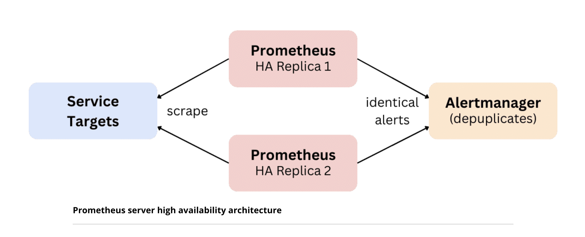

# High Availability Prometheus

## Overview and Architecture

You typically want the critical alerting features of your monitoring system to be highly available, so that you can always learn about problems in your other systems and services.

The Prometheus approach to solving this is to run two (or more) identically configured Prometheus servers that scrape the same data and evaluate the same alerting rules. Both servers will send identical alerts to the Alertmanager, but the Alertmanager will know how to deduplicate them based on their label sets (to prevent multiple notifications). Neither server has knowledge of the other server in the pair, which keeps the architecture simple and avoids tight clustering dependencies.



It is important to note that this model prioritizes the reliability of detecting faults and sending alert notifications, but it is not a full data durability solution. The two identical Prometheus servers are not clustered and have no knowledge of each other.

Thus, if you lose one server and reprovision it, it will not re-replicate data from the other server. This means that there can be occasional gaps in your monitoring data, even in highly-available alerting setups. The Prometheus community accepts this and does not try to solve this by itself, since the absolute priority of the project is to reliably deliver alerts.

## Querying HA Servers

When you want to query and graph data from a highly available Prometheus server setup in a dashboard like Grafana, the question arises, " Which of the two server instances should you query?"

There are multiple options here, with different advantages and drawbacks. Choosing which of these approaches is the right one for you will depend on your needs and preferences. Let's take a closer look at each one below.

### Always querying one server of the pair

One choice is to always query only one server of the pair. This option will always show exactly the same data in graphs. However, Prometheus server failures require a manual failover to the other server and all query load is carried by a single server.

### Load Balance between servers

Another option is to load-balance between the servers, which spreads the query load over both servers. However, graph results will look slightly different on every refresh, since the two servers scrape data at different phases of the common scrape interval. A load balancer that runs periodic health checks can ensure that queries always go to a healthy server.

### Load Balance with default and fallback backend

A third option is to load-balance with default and fallback backends. You can configure a load-balancer to always query only the first server in a pair by default, but query the second one in case the first one becomes unhealthy. This leads to highly available querying while still giving you consistent graph results most of the time.

## Avoid Alerting duplication

When you configure two identical Prometheus servers to send alerts to the same Alertmanager (or Alertmanager cluster), equivalent alerts generated by the two servers will have identical label sets. This allows the Alertmanager to deduplicate these alerts and only send out single notifications for each alert. However, you may run into a problem when you distinguish both Prometheus servers using an external label to identify the replica within the highly-available pair.

In the prometheus configuration you can have something like this

```yaml
global:
  external_labels:
    replica: A # (or "B" for the second replica)
```

Prometheus attaches the configured external labels to any outgoing alerts or samples when talking to external systems (via federation, remote storage integrations, or alerting). This serves to identify the Prometheus server that the data came from. However, you will usually want to remove this extra replica label when sending alerts to the Alertmanager, so that the Alertmanager can still deduplicate alerts as expected.

You can do this by adding a labeldrop relabeling rule to the alerting section in the Prometheus configuration file:

```yaml
alerting:
  # (...other alerting settings...)
  alert_relabel_configs:
    action: labeldrop
    regex: replica
```

This ensures that alerts sent from the two Prometheus servers in a pair will look identical to the Alertmanager.
