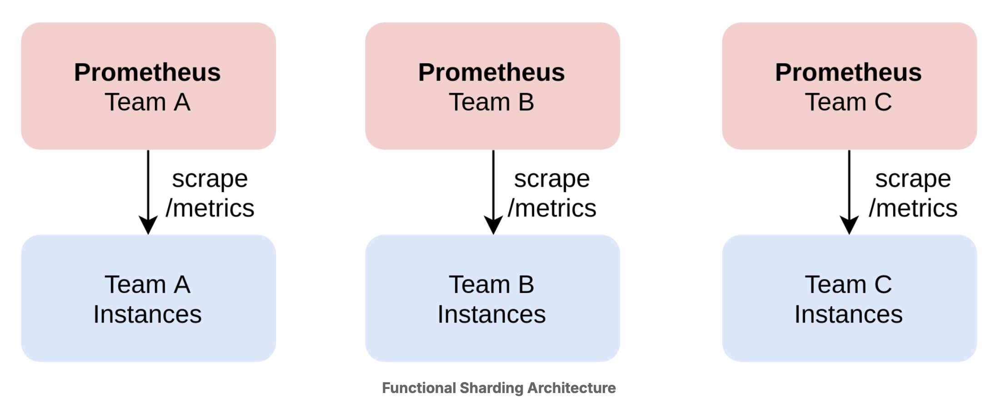
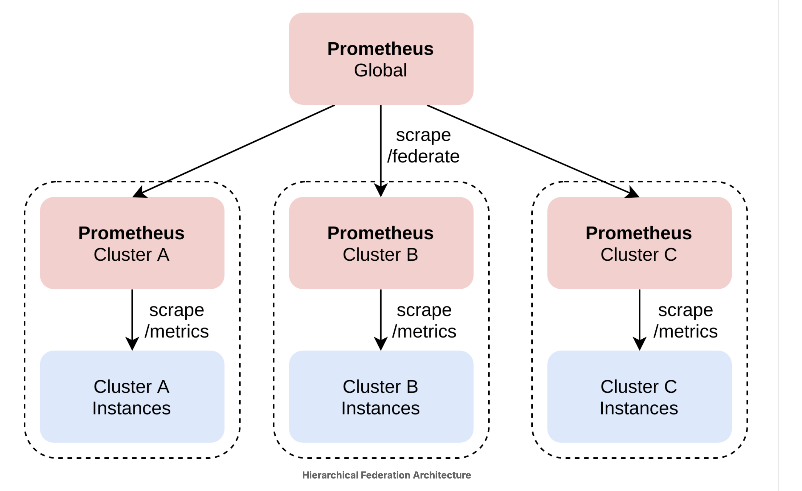
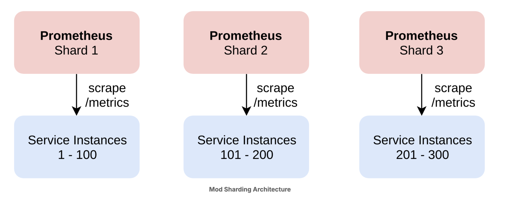

# Scaling Prometheus

While a single Prometheus server is very efficient at ingesting and storing data, it is possible to reach the limits of even a large server when pulling in and processing too much data. At some point, either your disk will run full, the TSDB will not be able to store data fast enough anymore, your server will be overwhelmed with queries, or you will run into some other bottleneck. Eventually, you will need to scale your Prometheus setup in other ways.

This chapter will only give a brief overview over the three main scaling strategies:

- functional sharding
- hierarchical federation
- horizontal mod-sharding

## Functional Sharding

Functional sharding simply means deploying different Prometheus servers for different services, teams, functions, and so on. How exactly you split up your Prometheus servers will depend on the nature of your organization, its services, and your scaling needs. Splitting up Prometheus servers by function is a good idea beyond scalability reasons, because it enables teams to run their own monitoring and be responsible for it.



## Hierarchical Federation

Probably the most used. In a hierarchical federation, you deploy different Prometheus servers for different clusters, regions, or similar natural sharding boundaries of a single service, then use federation to pull in aggregate metrics into a global (or higher-level) Prometheus server.

In this fashion, you can build arbitrarily deep federation trees where higher levels of the tree have a more global, but also less detailed view of the world. For example, you may have global, regional, and datacenter federation levels for a large service.



## Horizontal mod sharding

In extreme cases, a single service in a single location can become too large to scrape using a single Prometheus server. In those cases, you can configure a set of otherwise identical Prometheus servers to each only scrape a subset of their configured targets, based on the hash over some of the targets’ labels.



You can achieve this by using the hashmod relabeling action to write the hash of a set of target labels into a temporary label, setting the modulus value in the relabeling rule to the number of shards, and then adding a second relabeling step that only keeps targets where the modulus of the hash matches the ordinal number (starting from 0) of the respective shard. For example, a scrape configuration for the first out of 10 shards could look like this:

```yaml
relabel_configs:
  - action: hashmod
    source_labels: [__address__]
    modulus: 10
    target_label: __tmp_hash
  - action: keep
    source_labels: [__tmp_hash]
    regex: 0 # Only keep targets for the first shard (index 0).
```

## Example Scaling via Hierarchical Federation

Let’s set up an example of hierarchical federation. Pretend that you have two clusters (although you really only have one machine to run this lab on), with a local Prometheus server in each cluster. Each local Prometheus server monitors three demo service instances and uses recording rules to create per-job aggregated metrics for their cluster.

A third, global Prometheus server uses federation to pull in those aggregate metrics about both clusters from the per-cluster /federate Prometheus endpoints. These endpoints return the last value of all series selected via a set of match[] HTTP parameters, and the federating Prometheus then ingests them as normal metrics.

Check the prom-federated folder for details.

There are two files prometheus cluster-a and prometheus cluster-b with the same configuration to fetch our lf application. The only difference is that the they have a different external label. Please take into consideration that we are scraping the same application twice, in real life the two cluster will have different applications

We also add a _recording_rules.yml_ file to record some queries. When the prometheus global is up you can check that the query is working as expected by typing

```promql
job:demo_api_request_duration_seconds_count:rate5m
```

And see two results separated by the external label (cluster="a",cluster="b") you inserted in the configuration
