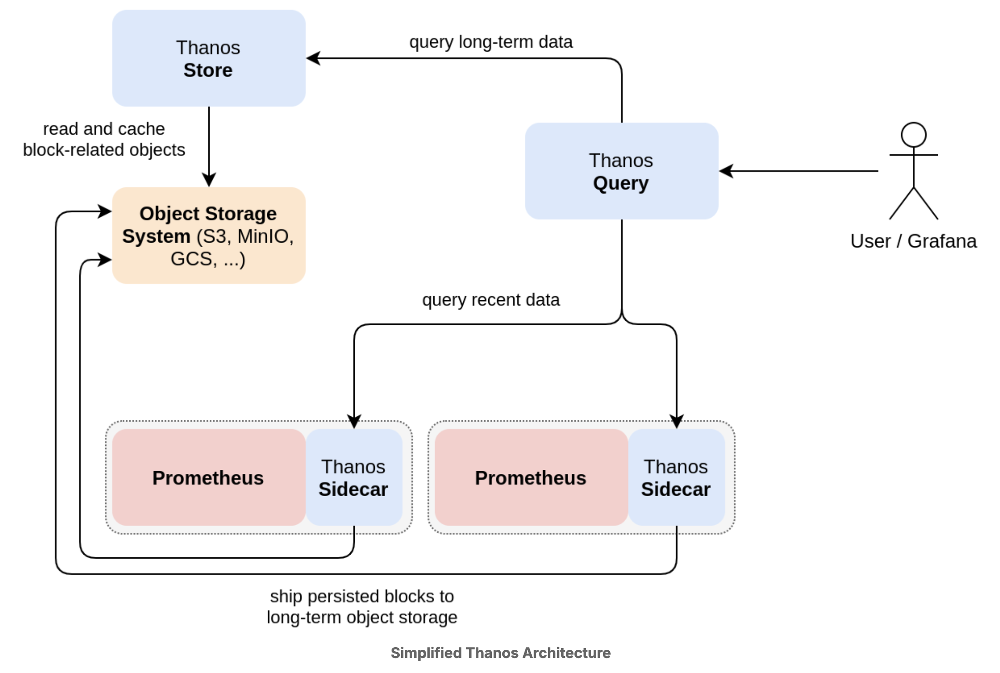

# Remote Storage

## Overview

Prometheus's local storage is limited in its scalability and durability. Instead of trying to solve long-term storage in Prometheus itself, Prometheus has a set of interfaces that allow integrating with remote long-term storage systems:

- Prometheus can write all samples that it ingests to a remote URL in a standardized format, in near-time (usually sample batches are sent every couple of seconds, read from the local storage's write-ahead log as a buffer)
- Prometheus can read back sample data from a remote URL in a standardized format and then run PromQL queries on it.


The read and write protocols both use a snappy-compressed protocol buffer encoding over HTTP. The protocols are not considered as stable APIs yet and may change to use gRPC over HTTP/2 in the future

Note that on the read path, Prometheus only fetches raw series data for a set of label selectors and time ranges from the remote end. All PromQL evaluation on the raw data still happens in Prometheus itself. This means that remote read queries have some scalability limit, since all necessary data needs to be loaded into the querying Prometheus server first and then processed there. However, supporting fully distributed evaluation of PromQL was deemed infeasible for the time being.

## Existing Integrations

- InfluxDb: InfluxDB, a general-purpose time series database, supports the remote read and write interfaces natively.
- Cortex: a horizontally scalable reimplementation of Prometheus based on cloud data stores, supports the remote read and write interfaces natively.
- Grafana Mimir: an open source software project that provides a scalable long-term storage for Prometheus.

## Remote Storage via Thanos

Prometheus's standard remote-write-based storage protocol has some drawbacks: it is relatively inefficient to send samples in near-time to a remote endpoint, because time series identities need to be sent along with their samples on every write, and sample data also compresses better when batching up many samples for the same series over time. Furthermore, the receiving end needs to reimplement Prometheus-style batching of ingested time series data, before it can write out persisted blocks of final data in a more optimized way. This means that receivers of the remote write protocol are usually relatively complex systems.

_Thanos_ is a popular alternative for providing durable long-term storage for Prometheus that does not require integrating with Prometheus's remote write protocol. Instead, it runs as a sidecar next to your existing Prometheus servers and ships fully persisted TSDB blocks from disk to a remote storage system like S3 or GCS. This allows Thanos to skip the reimplementation of the ingestion batching layer (it takes advantage of the fact that Prometheus is already doing this locally), and it can ship data more efficiently. Thanos then provides other components that allow an integrated query view over both the long-term storage (shipped blocks) and the more recent data that is still being batched up in Prometheus servers.

Thanos's main features are:

- Scalable and durable long-term storage
- Global query view
- Deduplicating query data from HA pairs.



In this architecture, the Thanos Sidecar component ships TSDB blocks to the object storage system, the Thanos Store component is in charge of reading back block data from the object storage, and the Thanos Query component provides an integrated querying view.

## Configure Cortex

You will configure Prometheus to write all ingested samples to Cortex and to read them back when executing PromQL queries.

For the purposes of this lab, Cortex will be run in single-process mode.

First Clone cortex here:

    git clone --depth=1 https://github.com/cortexproject/cortex.git

Then start it (SeaweedFS to emulate S3, and Cortex):

    cd ./cortex/docs/getting-started
    # In the docker compose remove the post start statement
    docker compose up seaweedfs -d
    docker exec -it getting-started-seaweedfs-1 /bin/sh
    cd /
    ./seaweedfs-init.sh

Now run cortex
docker compose up cortex -d

In your Prometheus configuration file, add the following `remote_write` and `remote_read` sections at the top level (not nested under `scrape_configs`).

In our case I just copied the cortex and the seaweedfs container inside my docker-compose and set them with the _cortex_ profile. This is much easier to connect our prometheus container to cortex

## Configure Thanos

You will configure Thanos to ship data to MinIO, an S3-compatible object storage system and get an integrated view of Prometheus's most recent data and the data that Thanos has shipped to MinIO.

In order for Thanos to tag which blocks came from which Prometheus server, you will need to configure external labels for your Prometheus server.

Add an external_labels to prometheus.yml

```yaml
external_labels:
  prometheus: main
```

For Thanos to safely ship TSDB blocks to long-term storage, Prometheus and Thanos must share access to the same TSDB data directory. Additionally, background compaction in Prometheus’s local TSDB must be disabled to avoid conflicts during block shipping.

To achieve this, remove the existing Prometheus container, create a Docker volume for the Prometheus data directory, and start a new Prometheus container with the following flags.

### --storage.tsdb.min-block-duration=2h

#### Purpose

Defines the minimum time range covered by a TSDB block before it is finalized.

#### What it does

- Prometheus writes samples into in-memory chunks
- After min-block-duration, a block is cut and written to disk
- The block becomes immutable

#### Why this matters for Thanos

- Thanos Sidecar only uploads complete blocks
- Smaller block durations = more frequent uploads
- Predictable block boundaries

### --storage.tsdb.max-block-duration=2h

#### Purpose

Defines the maximum time range a TSDB block can cover.

#### Why min = max

Setting: `min = max = 2h` means:

- No background compaction
- Prometheus produces exactly one 2-hour block
- Blocks are never merged locally

#### Why background compaction must be disabled for Thanos

Normal Prometheus behavior

2h blocks → compacted into 8h → 24h → ...

This causes problems because:

- Thanos might upload a block
- Prometheus later deletes or rewrites it
- Data corruption or missing blocks may occur

#### Thanos Compatible Behaviour

Prometheus: produces only 2h blocks
Thanos: performs all compaction centrally

### What the Docker volume does

#### Purpose

- Persists TSDB data across container restarts
- Allows Thanos Sidecar to read the same data directory
- Prevents data loss

#### Why this is mandatory

- Thanos Sidecar reads blocks directly
- WAL + blocks must be shared
- Container-local filesystem is not sufficient

### Resulting Architecture

Prometheus
├── WAL (local)
├── 2h TSDB blocks
└── shared data directory
↓
Thanos Sidecar
├── uploads blocks to MinIO
└── exposes StoreAPI

### Summary

Prometheus:

- ingests metrics
- writes WAL
- cuts fixed-size blocks
- does NOT compact

Thanos:

- ships blocks
- compacts centrally
- serves long-term queries

## Configure Minio

Start a local Minio instance for persistent block storage. Create a file named `bucket.yml` in your home directory.

This file will hold the object storage (MinIO) configuration that Thanos should use for uploading data.

## Configure Thanos Sidecar

Next, start Thanos in Sidecar mode, pointing it at the object storage configuration file and the Docker volume of your Prometheus container.

In addition to uploading TSDB blocks to object storage, the Thanos Sidecar also implements and exposes a gRPC Store API.

Through this API, the Thanos Query component can query metrics directly from Prometheus, providing a unified view of both the most recent in-memory data and the historical data shipped to long-term storage.

## Configure Thanos Query

To complete the setup, you can now query metrics from both MinIO (long-term storage) and the local Prometheus server via the Sidecar component.

Bring up the Thanos Query component and configure it to connect to the Sidecar using the `--endpoint` flag. This allows Thanos Query to provide a unified view of recent in-memory data and historical TSDB blocks.

## Conceptual Workflow

Prometheus
└─ TSDB + WAL
|
v
Thanos Sidecar (gRPC StoreAPI)
|
v
Thanos Query
|
v
User queries via HTTP/UI on port 10902

- Thanos Query sees both recent in-memory metrics and persisted TSDB blocks.
- Long-term blocks are stored in MinIO (bucket.yml).
- Queries are integrated across multiple Prometheus instances if needed.

✅ This is the final piece to make Thanos fully operational in your lab:

- Prometheus → writes metrics to TSDB
- Thanos Sidecar → reads TSDB and uploads to MinIO, exposes gRPC
- Thanos Query → queries data from Sidecar (recent) + MinIO (historical)

## At the end

Try out some queries and confirm that Thanos returns the same data as your local Prometheus server, but with an additional `prometheus="main"` label attached to all returned time series. This corresponds to the external labels that you configured on your Prometheus server.

If your Thanos setup stored data from multiple Prometheus servers, you can use this label in a selector to ensure you are selecting data only from the intended server.

If left running for a couple of hours, the Thanos Sidecar should eventually log lines like this, indicating that it uploaded existing TSDB blocks to MinIO:

```bash
docker logs thanos-sidecar
...
ts=2025-04-11T20:32:16.226440512Z caller=shipper.go:372 level=info msg="upload new block" id=01JRK8TW99VS8HXCC3FNP
```

You should also see block objects appearing in the `thanos` bucket in the MinIO web interface.

In this lab, you explored some of Thanos’ functionality for long-term storage and integrated querying. Thanos has several more components that may make sense to run in a production setup. For example:

- A **Compactor** component that compacts blocks in the object storage system in a similar way as Prometheus compacts blocks locally.
- A **Rule** component which can be used to evaluate Prometheus rules outside of the Prometheus server.

Thanos can also **deduplicate samples** originating from two servers in a high-availability (HA) setup.
