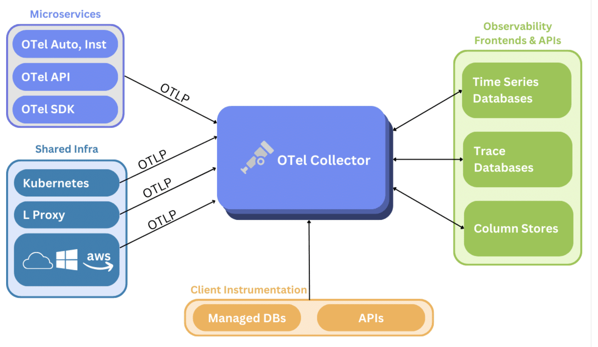

# Transitioning from and integrating with other Monitoring System

When transitioning from previous monitoring systems to Prometheus, it is not always feasible to switch over all monitoring to Prometheus at once. It is also possible that an organization only wants to use Prometheus for a subset of its functionality. Often, organizations also have to evolve when tooling or open standards change. In any of these cases, you may need to integrate Prometheus with other systems so that a gradual migration or partial usage is possible.

Company may have>

- Nagios to take on alerting. In this case prometheus has a Nagios plugin that allows Nagios to make promql queries
- You may have services instrumented with other instrumentation libraries already and want to ingest their metrics into Prometheus. Fundamentally, you will need some layer of translation between the existing format and Prometheus's.

For example: _StatsD Metrics_

If you have existing services sending StatsD metrics and are not ready to instrument them with native Prometheus metrics yet, you can replace the traditional StatsD( server with Prometheus’s StatsD Exporter.

This exporter receives events in the StatsD wire protocol and aggregates them into Prometheus metrics. A configuration file allows mapping the hierarchical StatsD metrics format into labeled Prometheus metrics.

You can deploy the StatsD exporter in two ways:

1. Completely replace an existing StatsD server with the exporter
2. Configure an existing StatsD server to duplicate all incoming events to the exporter

The latter setup is useful in case you still want to use StatsD to write out data points to Grafana or a similar non-Prometheus time series database for the time being.

Or _Graphite_ If you have services that are directly writing metrics into a Graphite time series database, you can use the Graphite Exporter to receive the Graphite wire protocol and expose the incoming metrics in a Prometheus-compatible format:

A similar mapping from Graphite's hierarchical format to Prometheus’s label-based format is possible here as in the StatsD exporter case.

## Opentelemetry

OpenTelemetry (OTel) is an open standard for observability data, including metrics, traces, and logs. OTel only concerns itself with generating, exporting, and collecting telemetry data and explicitly excludes storage and visualization—leaving those concerns to other tools. Rather than using an exporter per instrumented source type, as in our previous examples, it may make more sense to adopt OTel tooling. This is because metrics emitted by services can be received by a single OTel collector and sent to any observability backend(s) that support the standard, whether that backend is Prometheus or another open source or vendor-based tool.

The OTel collector provides additional benefits beyond just replacing metrics exporters. It removes the need to operate multiple agents/collectors for metrics, traces, and logs. For a single service you may currently run, for example, a metrics exporter, a log aggregator (Fluent Bit), and a network proxy (Envoy) for traces, because the OTel collector can process all three signals, it can replace all of these agents for observability. The OTel collector allows services to offload observability data locally while the collector handles backend communication, including retries, batching, encryption, and sensitive data filtering.

The OTel collector provides a receiver, processing capabilities, and exporters for Prometheus. The Prometheus receiver can collect metrics from services that expose Prometheus metrics, replacing the need for the Prometheus server to scrape targets. Once received, it can modify data attributes and/or process data in multiple ways. It also provides several ways to export metrics: Prometheus exporter, Prometheus Remote Write exporter, and the OpenTelemetry Protocol (OTLP) HTTP exporter, which uses Prometheus’ native OLTP endpoint.

### Ingesting Prometheus Metrics into other TSDB

Perhaps you are already instrumenting your services with native Prometheus metrics, but still want to also ingest those metrics into another time series database. There are two main approaches to achieve this:

- You can use an alternative exposition mechanism together with the instrumentation part of the Prometheus client library you are using. For example, Prometheus’s Go client library already supports pushing its samples to Graphite. The same is true for the Python client library.
- You can use Prometheus's remote write and read interfaces (discussed earlier) to replicate all samples that a Prometheus server scrapes into another time series database.
