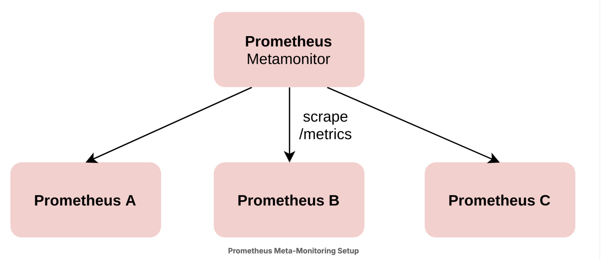

# Monitoring and Debugging Prometheus

Who watches the watchers? Prometheus and Alertmanager are critical components - if they are down or misbehave, you will not receive notifications about anything else being broken in your infrastructure. In this chapter you will learn how to troubleshoot, monitor, and diagnose your Prometheus servers themselves.

## Metrics Based Meta Monitoring

Prometheus exposes a set of white-box metrics about itself on its /metrics path that allow diagnosing how it is performing and what is happening inside it. You can store and query those metrics by making Prometheus scrape itself, but this only works as long as that particular Prometheus server is working fine. To reliably alert when a Prometheus server is misbehaving, it is better to set up a separate meta-monitoring Prometheus server (or set of them) that does nothing else than monitoring all of your other Prometheus servers.



You can then configure a set of meta-monitoring rules that alert you when one of the Prometheus servers behaves badly. Let’s have a look at some example alerts you could configure.

The following alerting rule alerts you when a Prometheus server has not been ingesting any samples in the last five minutes:

```yaml
groups:
- name: meta-monitoring
 rules:
 - alert: PrometheusNotIngestingSamples
   expr: |
     rate(prometheus_tsdb_head_samples_appended_total{job=~"prometheus.*"}[5m]) == 0
   for: 5m
   labels:
     severity: critical
   annotations:
     title: "{{$labels.job}} is not ingesting samples"
     description: "{{$labels.job}} at {{$labels.instance}} has not ingested any samples in the last 10 minutes."
     runbook: "troubleshooting/prometheus-not-ingesting.md"
```

Or what about notifications to the Alertmanager being dropped? You could alert on that with this rule:

```yaml
groups:
- name: meta-monitoring
 rules:
 - alert: PrometheusNotificationFailures
   expr: |
     rate(prometheus_notifications_dropped_total{job=~"prometheus.*"}[5m]) > 0
   for: 5m
   labels:
     severity: critical
   annotations:
     title: "{{$labels.job}} is failing to send alert notifications"
     description: "{{$labels.job}} at {{$labels.instance}} has failed to send {{$value}}/s alert notification notifications in the last 5 minutes."
     runbook: "troubleshooting/prometheus-notification-failures.md"
```

Alertmanager can be monitored in a similar way, as it also exposes metrics about itself. The question is what to do when your Alertmanager cluster or all of your Prometheus servers fail entirely. One answer to this is to use a constantly firing heartbeat alert in combination with an external party that notifies you when the alert notification is no longer being received.
